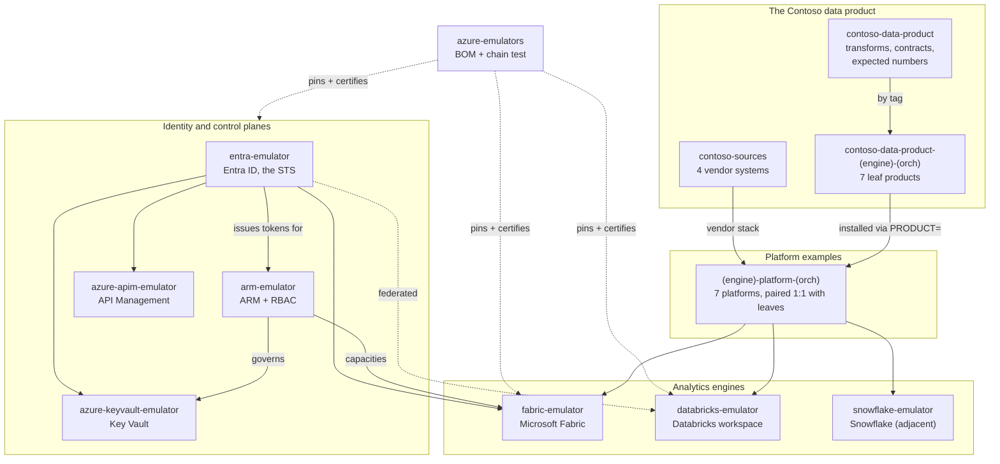

# emulators

**📖 [calvinchengx.github.io/emulators](https://calvinchengx.github.io/emulators/)**: the full map, the argument, and how to start.

The front door to the emulator ecosystem: emulators that make an AI coding
agent viable as the builder of Azure-shaped applications and data products.
The agent builds and proves everything offline against local, clean-room
emulators of the control planes nobody else emulates (Entra ID, ARM with RBAC,
Key Vault, API Management, Fabric, Databricks, Snowflake), then moves to the
real tenant with no code changes. Tenant-speed iteration becomes machine-speed
iteration: months becomes days.

That acceleration works on two fronts:

- **Applications.** Any Azure-shaped app needs identity, RBAC, secrets and a
  gateway before it does anything interesting. entra, arm, keyvault and apim
  give an agent that whole substrate locally: no tenant, no waiting, no cost,
  resettable in seconds.
- **Data products.** fabric, databricks and snowflake plus the Contoso matrix
  do the same for the data estate: an agent builds a full medallion data
  product offline, then flips one flag to the real platform. The proof is
  measurable: one product, three engines, because iteration was free.

This repo is a **directory, not a second BOM**. Version pinning, the certified
compose and the chain test live in
[azure-emulators](https://github.com/calvinchengx/azure-emulators); this repo
maps the whole ecosystem, including what sits outside that BOM.

## The map

## The emulators

| Repo | Emulates | Role | Docs |
|---|---|---|---|
| [entra-emulator](https://github.com/calvinchengx/entra-emulator) | Microsoft Entra ID | **The STS.** MSAL-compatible OIDC/OAuth2; issues every token the others validate | [site](https://calvinchengx.github.io/entra-emulator/) |
| [arm-emulator](https://github.com/calvinchengx/arm-emulator) | Azure Resource Manager | Control plane + `Microsoft.Authorization` RBAC; governs its sibling data planes | [site](https://calvinchengx.github.io/arm-emulator/) |
| [azure-keyvault-emulator](https://github.com/calvinchengx/azure-keyvault-emulator) | Key Vault | Data plane: secrets, real RSA/EC crypto, X.509 certificates | [site](https://calvinchengx.github.io/azure-keyvault-emulator/) |
| [azure-apim-emulator](https://github.com/calvinchengx/azure-apim-emulator) | API Management | Management plane, gateway, policies | [site](https://calvinchengx.github.io/azure-apim-emulator/) |
| [fabric-emulator](https://github.com/calvinchengx/fabric-emulator) | Microsoft Fabric | Control plane + OneLake, with a real Spark engine behind it | [site](https://calvinchengx.github.io/fabric-emulator/) |
| [databricks-emulator](https://github.com/calvinchengx/databricks-emulator) | Azure Databricks | Workspace REST; PAT + OIDC identity, entra as optional federated issuer | [site](https://calvinchengx.github.io/databricks-emulator/) |
| [snowflake-emulator](https://github.com/calvinchengx/snowflake-emulator) | Snowflake | Account emulator on DuckDB. **Adjacent**: same discipline, not an Azure service, not in the BOM | [site](https://calvinchengx.github.io/snowflake-emulator/) |

Composed by [azure-emulators](https://github.com/calvinchengx/azure-emulators):
the bill of materials, the certified `docker compose`, and the chain test that
proves the six Azure members work against each other.

## The data product

| Repo | Role |
|---|---|
| [contoso-sources](https://github.com/calvinchengx/contoso-sources) | The vendors, and nothing else: three OpenAPI services plus a Postgres/CDC change stream, shared by every platform |
| [contoso-data-product](https://github.com/calvinchengx/contoso-data-product) | The core: transform logic, ODCS contracts, and the expected numbers every engine must reproduce |

One product, every engine × orchestrator cell. Leaves are
`contoso-data-product-<engine>-<orch>`; platforms are
`<engine>-platform-<orch>`; a platform runs the leaf with the matching suffix.

<!-- BEGIN matrix (generated by scripts/render_tables.py) -->

| Engine | Orchestrator | Leaf product | Platform |
|---|---|---|---|
| Fabric | Airflow 3 | ✅ [leaf](https://github.com/calvinchengx/contoso-data-product-fabric-airflow3) | ✅ [platform](https://github.com/calvinchengx/fabric-platform-airflow3) |
| Fabric | Notebooks + Data Pipelines | ✅ [leaf](https://github.com/calvinchengx/contoso-data-product-fabric-notebook-pipelines) | ✅ [platform](https://github.com/calvinchengx/fabric-platform-notebook-pipelines) |
| Fabric | Built-in Airflow | ✅ [leaf](https://github.com/calvinchengx/contoso-data-product-fabric-airflow-builtin) | ✅ [platform](https://github.com/calvinchengx/fabric-platform-airflow-builtin) |
| Databricks | Databricks Jobs | ✅ [leaf](https://github.com/calvinchengx/contoso-data-product-databricks-jobs) | ✅ [platform](https://github.com/calvinchengx/databricks-platform-jobs) |
| Databricks | Airflow 3 | ✅ [leaf](https://github.com/calvinchengx/contoso-data-product-databricks-airflow3) | ✅ [platform](https://github.com/calvinchengx/databricks-platform-airflow3) |
| Snowflake | Snowflake Tasks | ✅ [leaf](https://github.com/calvinchengx/contoso-data-product-snowflake-tasks) | ✅ [platform](https://github.com/calvinchengx/snowflake-platform-tasks) |
| Snowflake | Airflow 3 | ⬜ [leaf](https://github.com/calvinchengx/contoso-data-product-snowflake-airflow3) | ⬜ [platform](https://github.com/calvinchengx/snowflake-platform-airflow3) |

✅ built · ⬜ reserved, holding a README and a LICENSE

<!-- END matrix -->

## Where next

- **Run the family:** `docker compose up` in
  [azure-emulators](https://github.com/calvinchengx/azure-emulators), the
  certified set in one command.
- **Run a data product:** a built platform's `make up PRODUCT=...`, for
  example [fabric-platform-airflow3](https://github.com/calvinchengx/fabric-platform-airflow3).
- **The full argument:** the
  [docs site](https://calvinchengx.github.io/emulators/), including why these
  emulators exist, what the evidence discipline proves, and how they compare
  with everything else out there.

## License

Apache-2.0.
