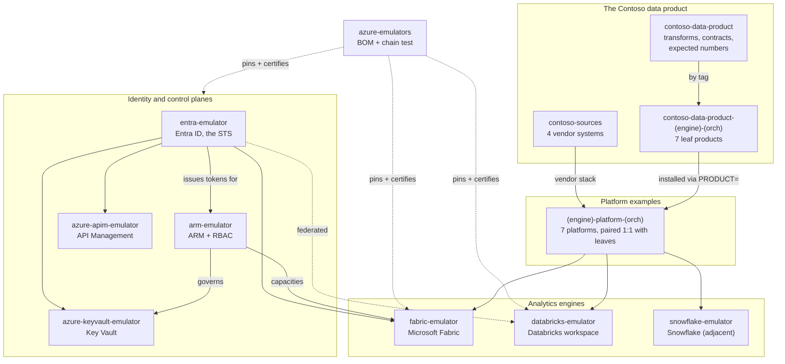

# 01 — The map

Every repo in the ecosystem, and how they relate.

## Four tiers

**Tier 1: the emulators.** Seven services, each in its own repo, each with its
own release cadence and its own image on GHCR. Six are Azure services and
compose as a family; snowflake is adjacent. Detail in
[The emulators](02-the-emulators.md).

**Tier 2: the composition.**
[azure-emulators](https://github.com/calvinchengx/azure-emulators) runs no
emulator of its own. It ships no binary, no image and no Go module. It is the
neutral place that pins a certified combination (the bill of materials), wires
the services together in one `docker compose`, and runs the chain test that no
single member's CI can run: proving that ARM validates *entra's* tokens, that
the advertised issuer matches the one its peers check, and that the images boot
together in the right order.

**Tier 3: the data product.** Two shared repos plus a matrix of leaves.
[contoso-sources](https://github.com/calvinchengx/contoso-sources) is the
vendors and nothing else: three OpenAPI services and a Postgres change stream.
[contoso-data-product](https://github.com/calvinchengx/contoso-data-product) is
the core: transform logic, data contracts, and the expected numbers every
engine must reproduce. Each leaf carries only the per-platform idiom.

**Tier 4: the platforms.** The infrastructure that runs a product: compose
files, emulator pins, vendor stacks, provisioning and connections. A platform
contains no Contoso name and no product file. It takes `PRODUCT=<path>` and
installs whatever you give it.

## The naming pattern

One pattern, and it is worth learning because it makes the matrix readable at a
glance:

- Platforms are `<engine>-platform-<orchestrator>`.
- Leaf products are `contoso-data-product-<engine>-<orchestrator>`.
- A platform runs the leaf with the **matching suffix**.

So `fabric-platform-airflow3` runs
`contoso-data-product-fabric-airflow3`. Neither names the other in code: the
platform is handed a path, and the leaf pulls the core by tag.

Two phrases capture the separation, and they appear verbatim in the repos:

> The platform installs the product and knows no Contoso.

> It is a product, not a platform.

That separation is what makes the engine comparison honest. If each platform
carried its own copy of the vendors and its own transform logic, a difference
between Fabric and Databricks results would be unattributable. Two copies of a
vendor is where a comparison dies.

## The inventory

### Emulators

| Repo | Emulates | In the BOM |
|---|---|---|
| [entra-emulator](https://github.com/calvinchengx/entra-emulator) | Microsoft Entra ID | yes |
| [arm-emulator](https://github.com/calvinchengx/arm-emulator) | Azure Resource Manager + RBAC | yes |
| [azure-keyvault-emulator](https://github.com/calvinchengx/azure-keyvault-emulator) | Key Vault data plane | yes |
| [azure-apim-emulator](https://github.com/calvinchengx/azure-apim-emulator) | API Management | yes |
| [fabric-emulator](https://github.com/calvinchengx/fabric-emulator) | Microsoft Fabric | yes |
| [databricks-emulator](https://github.com/calvinchengx/databricks-emulator) | Azure Databricks workspace | yes |
| [snowflake-emulator](https://github.com/calvinchengx/snowflake-emulator) | Snowflake account | no, adjacent |

### Composition

| Repo | Role |
|---|---|
| [azure-emulators](https://github.com/calvinchengx/azure-emulators) | The BOM, the family compose, the chain test, and the family parity report |

### Data product

| Repo | Role |
|---|---|
| [contoso-sources](https://github.com/calvinchengx/contoso-sources) | The four vendor systems, shared by every platform |
| [contoso-data-product](https://github.com/calvinchengx/contoso-data-product) | Transform logic, contracts, and the expected numbers |

### The matrix

| Engine | Orchestrator | Leaf product | Platform |
|---|---|---|---|
| Fabric | Airflow 3 | ✅ [contoso-data-product-fabric-airflow3](https://github.com/calvinchengx/contoso-data-product-fabric-airflow3) | ✅ [fabric-platform-airflow3](https://github.com/calvinchengx/fabric-platform-airflow3) |
| Fabric | Notebooks + Data Pipelines | 🚧 [contoso-data-product-fabric-notebook-pipelines](https://github.com/calvinchengx/contoso-data-product-fabric-notebook-pipelines) | ✅ [fabric-platform-notebook-pipelines](https://github.com/calvinchengx/fabric-platform-notebook-pipelines) |
| Fabric | Built-in Airflow | ⬜ [contoso-data-product-fabric-airflow-builtin](https://github.com/calvinchengx/contoso-data-product-fabric-airflow-builtin) | ⬜ [fabric-platform-airflow-builtin](https://github.com/calvinchengx/fabric-platform-airflow-builtin) |
| Databricks | Databricks Jobs | ✅ [contoso-data-product-databricks-jobs](https://github.com/calvinchengx/contoso-data-product-databricks-jobs) | ✅ [databricks-platform-jobs](https://github.com/calvinchengx/databricks-platform-jobs) |
| Databricks | Airflow 3 | ⬜ [contoso-data-product-databricks-airflow3](https://github.com/calvinchengx/contoso-data-product-databricks-airflow3) | ⬜ [databricks-platform-airflow3](https://github.com/calvinchengx/databricks-platform-airflow3) |
| Snowflake | Snowflake Tasks | ⬜ [contoso-data-product-snowflake-tasks](https://github.com/calvinchengx/contoso-data-product-snowflake-tasks) | ✅ [snowflake-platform-tasks](https://github.com/calvinchengx/snowflake-platform-tasks) |
| Snowflake | Airflow 3 | ⬜ [contoso-data-product-snowflake-airflow3](https://github.com/calvinchengx/contoso-data-product-snowflake-airflow3) | ⬜ [snowflake-platform-airflow3](https://github.com/calvinchengx/snowflake-platform-airflow3) |

✅ built · 🚧 in progress · ⬜ reserved

Reserved cells are real repos holding a README and a LICENSE. They exist so the
shape of the matrix is visible before every cell is filled, and so a cell can
be started without a naming debate.

## The one thing that must line up

Tokens carry `iss = <entra login origin>/<tenant>/v2.0`, and the peers validate
that exact value. **entra must advertise the origin they check.** On the family
compose network that origin is `https://entra-emulator:8443`, which is why the
entra service sets `PUBLIC_ORIGIN` and every peer's issuer setting repeats it
verbatim.

Get it wrong and every call fails with an issuer mismatch. It is the single
most common way these stacks break, and it is also the seam that makes the
switch to a real tenant a configuration change: point the issuer variables at
your tenant and nothing else moves.
