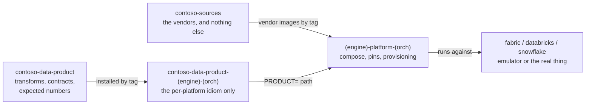

# 03 — The data product matrix

One data product. Three engines. Seven orchestration idioms. The point is that
the *product* stays the same while the *platform* changes, so a comparison
between Fabric, Databricks and Snowflake is a comparison of engines rather than
of who wrote the fixtures.

## Four tiers, and why the split is load-bearing

### 1. `contoso-sources`: the vendors

Three OpenAPI services and a Postgres database with a CDC change stream, plus
the simulators and fixture generators that populate them. `sources.yaml` is a
declaration of what the vendors are, not a compose file: each platform
generates its own vendor stack from it.

It exists as a separate repo for one reason, and the repo states it plainly:

> Two copies of a vendor is where a comparison dies.

If `fabric-platform-airflow3` carried its own vendor fixtures and
`databricks-platform-jobs` carried different ones, any difference in the gold
numbers would be unattributable. Shared vendors make the difference mean
something.

### 2. `contoso-data-product`: the core

The transform logic (bronze and silver in Spark, gold in dbt SQL), the ODCS
data contracts and their identities, the tests, and the expected numbers.

The expected numbers are the oracle that makes the whole matrix work. Every
engine must reproduce `revenue_usd 129,341,157.6700` across `474,044` sale
lines. A platform that finishes green but produces different numbers has not
run the product, it has run something else, and `compare_products.py` says so.

The core is consumed **by tag**, never by path. A path dependency is what broke
one of the platforms: it makes the leaf silently track an uncommitted working
tree, so the thing that passed locally is not the thing anyone else runs.

### 3. The leaf products: the idiom

A leaf carries only what is genuinely per-platform: the DAG, the job
specification, the notebooks or the task graph; the sink configuration; the dbt
profile. Nothing else. Each leaf README says it:

> It is a product, not a platform.

`contoso-data-product-databricks-jobs`, for example, is `steps/` with one
module per pipeline stage, each with its own `main()`, because that is how a
Databricks team writes it. The transform logic inside those steps comes from
the core.

### 4. The platforms: the infrastructure

Compose files, emulator pins (fabric by digest, entra, keyvault, arm, Spark,
SQL Server, OpenMetadata), the vendor stack generated from `contoso-sources`,
provisioning, connections, and a `make up`.

A platform contains no Contoso name and no product file:

> The platform installs the product and knows no Contoso.

It takes `PRODUCT=<path>` and runs whatever it is handed. That is what makes a
platform reusable for your own data product rather than a demo you have to
gut.

## The matrix

<!-- BEGIN matrix (generated by scripts/render_tables.py) -->

| Engine | Orchestrator | Leaf product | Platform |
|---|---|---|---|
| Fabric | Airflow 3 | ✅ [contoso-data-product-fabric-airflow3](https://github.com/calvinchengx/contoso-data-product-fabric-airflow3) | ✅ [fabric-platform-airflow3](https://github.com/calvinchengx/fabric-platform-airflow3) |
| Fabric | Notebooks + Data Pipelines | ✅ [contoso-data-product-fabric-notebook-pipelines](https://github.com/calvinchengx/contoso-data-product-fabric-notebook-pipelines) | ✅ [fabric-platform-notebook-pipelines](https://github.com/calvinchengx/fabric-platform-notebook-pipelines) |
| Fabric | Built-in Airflow | ✅ [contoso-data-product-fabric-airflow-builtin](https://github.com/calvinchengx/contoso-data-product-fabric-airflow-builtin) | ✅ [fabric-platform-airflow-builtin](https://github.com/calvinchengx/fabric-platform-airflow-builtin) |
| Databricks | Databricks Jobs | ✅ [contoso-data-product-databricks-jobs](https://github.com/calvinchengx/contoso-data-product-databricks-jobs) | ✅ [databricks-platform-jobs](https://github.com/calvinchengx/databricks-platform-jobs) |
| Databricks | Airflow 3 | ✅ [contoso-data-product-databricks-airflow3](https://github.com/calvinchengx/contoso-data-product-databricks-airflow3) | ✅ [databricks-platform-airflow3](https://github.com/calvinchengx/databricks-platform-airflow3) |
| Snowflake | Snowflake Tasks | ✅ [contoso-data-product-snowflake-tasks](https://github.com/calvinchengx/contoso-data-product-snowflake-tasks) | ✅ [snowflake-platform-tasks](https://github.com/calvinchengx/snowflake-platform-tasks) |
| Snowflake | Airflow 3 | ⬜ [contoso-data-product-snowflake-airflow3](https://github.com/calvinchengx/contoso-data-product-snowflake-airflow3) | ⬜ [snowflake-platform-airflow3](https://github.com/calvinchengx/snowflake-platform-airflow3) |

✅ built · ⬜ reserved, holding a README and a LICENSE

<!-- END matrix -->

Reserved repos hold a README and a LICENSE. They exist so the shape of the
matrix is visible before every cell is filled: a reader can see what has been
deliberately left undone, rather than guessing whether an absent cell is
planned or impossible.

One row is worth reading carefully. **Snowflake Tasks has a built platform and
a reserved leaf**, so the platform currently runs a gold-only slice rather than
a leaf product of its own. Completing that pair is what would turn the Snowflake
column into a like-for-like comparison with the other two engines.

Statuses here are derived from what is on `main`, not from what a repository's
README says about itself. Several of those READMEs still describe themselves as
reserved over a tree carrying dozens of files. The table is generated from
[`members.json`](https://github.com/calvinchengx/emulators/blob/main/members.json)
by `scripts/render_tables.py`, and CI fails if the committed copy drifts.

## What each built cell demonstrates

**[fabric-platform-notebook-pipelines](https://github.com/calvinchengx/fabric-platform-notebook-pipelines)**
is the fullest one: four real vendor sources through a complete medallion into
a Fabric Lakehouse, a semantic model serving Power BI, and the lineage
catalogued in OpenMetadata. It runs against a published fabric-emulator
release, never a checkout, so anything that works there works for anyone, and
with one flag it runs against real Fabric.

It is also the exception to the separation described above: it predates the
platform/product split and carries its product inline, which is why its leaf
cell is still reserved. Read it as the end-to-end proof rather than as the
model of the platform/product boundary. For that,
[fabric-platform-airflow3](https://github.com/calvinchengx/fabric-platform-airflow3)
is the cleaner example.

**[fabric-platform-airflow3](https://github.com/calvinchengx/fabric-platform-airflow3)**
is the platform reduced to its essence: Airflow 3 plus a Fabric target you can
pin, with no DAGs, no dlt, no dbt and no Contoso name anywhere in it. It is the
clearest demonstration of the platform/product separation.

**[databricks-platform-jobs](https://github.com/calvinchengx/databricks-platform-jobs)**
runs the same product against databricks-emulator with Unity Catalog and
OpenMetadata, using Databricks Jobs rather than an external orchestrator.

**[snowflake-platform-tasks](https://github.com/calvinchengx/snowflake-platform-tasks)**
is a gold-only consumer, switchable between the emulator and a real Snowflake
account with `SNOWFLAKE_TARGET`.

## Why this matters for an AI agent

Porting a data product across engines is normally a project with a business
case attached. Here it is a matrix cell, because the expensive part, finding
out what each platform actually requires, happens against an emulator at
seconds per attempt rather than against three paid accounts at minutes per
attempt.

That is the concrete form of the argument in
[Building with AI agents](04-building-with-ai-agents.md): the emulators did not
make the porting *easy*, they made it *affordable enough to attempt*, and the
expected-numbers oracle made the result checkable without a human reading
dataframes.
